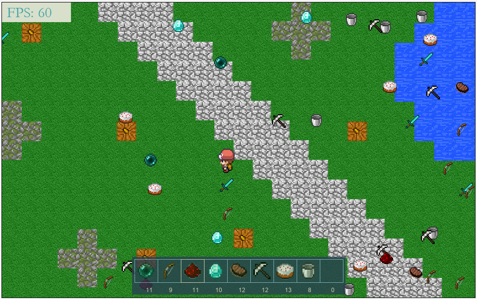

# InventoryWidget
A modular and extremely customizable inventory widget I created for my ICS4U class.

## A Quick Overview...
This game has been created to demonstrate the effectiveness of the inventory widget I have created. Here is how to use it.
- Use W, A, S, D to move up, left, down, or right, respectively
- Objects will randomly spawn, moving over them will remove the object from the world, and add it into your inventory
- The number keys (1, 2, 3, 4...) can be used to select the different slots of the inventory (from left to right)
- Press "p" to drop a single count of the item, and "o" to drop all of the currently selected item

## About the Widget...
This inventory widget has been designed to be extremely customizable, and can be used in many different situations. It can be customized to your liking in the following ways:
- Colors of the widget (numbers, slot background, outline, selected slot)
- Width and height of the image you would like to display each slot
- Number of slots the inventory has
- Maximum number of objects each slot can hold
- Font name and size of the numbers
- Scale of the images in comparison to their in-game image size
- Transparency of the inventory widget
- Space between the the edge of the inventory and each slot

## How To Use It...
The inventory class contains a detailed comment, explaining step by step how to implement this widget into your own scenarios.

## Credits...
- Nintendo Co., Ltd. for the image of Trainer
- Mojang Studios for the images of the various items and the background
